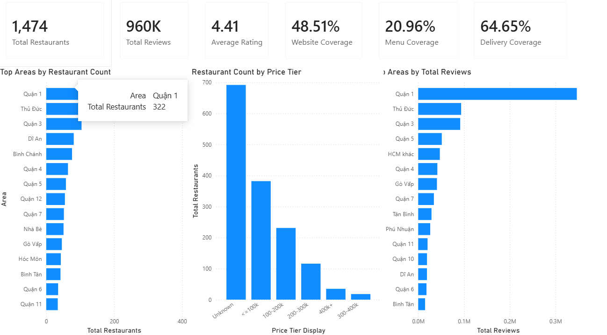
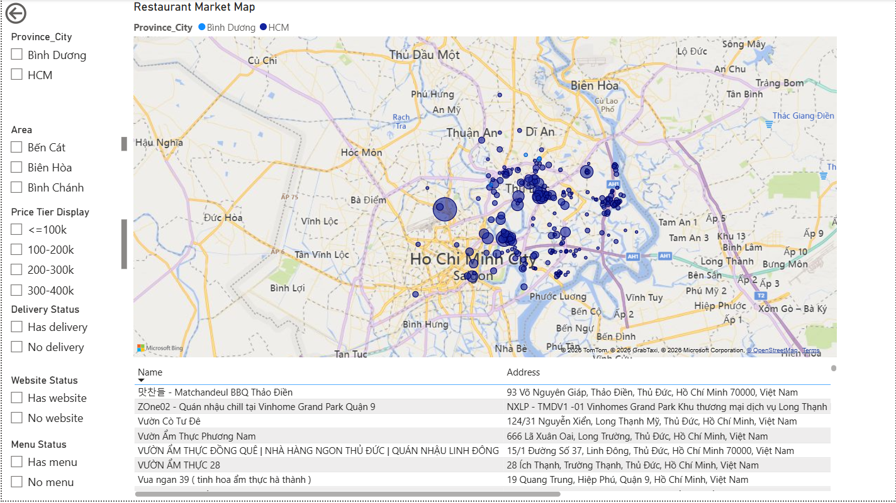
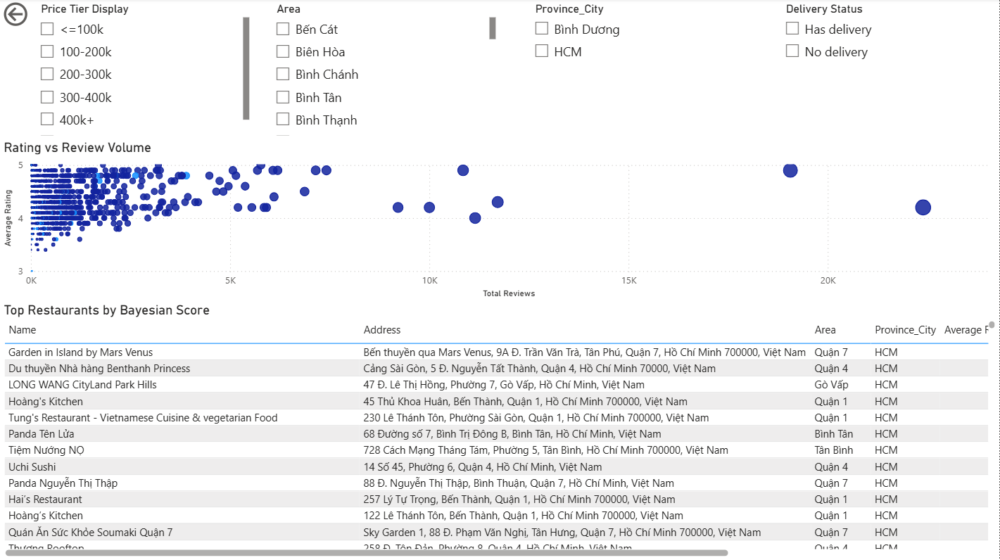
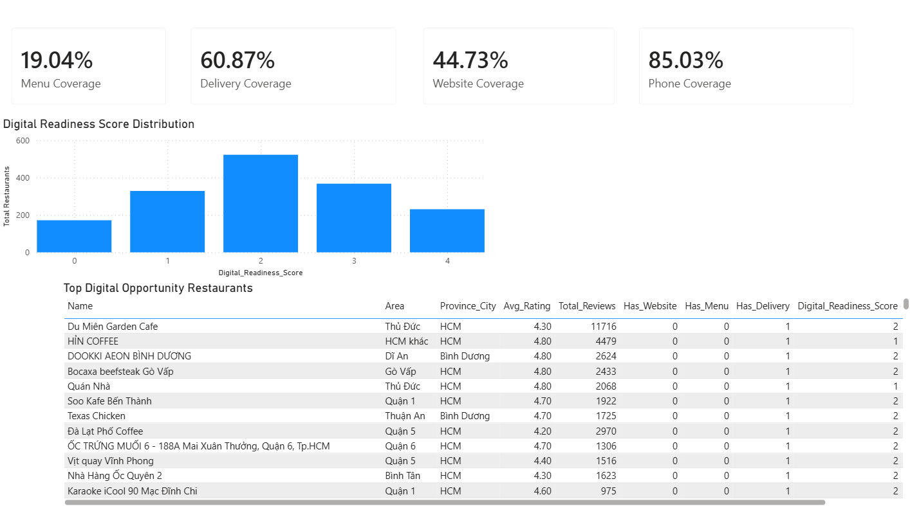

# Google Maps Restaurant Market Analysis

## Project Objective

This project analyzes Google Maps restaurant data to understand restaurant density, customer review volume, price segments, service options, and digital readiness in the Ho Chi Minh City and Bình Dương restaurant market.

The main goal is to identify:

* Which areas have high restaurant concentration
* Which restaurants are strong competitors
* Which price segments are most common
* How many restaurants have digital channels such as website, menu, phone, and delivery
* Which restaurants have opportunities to improve their digital presence

## Dataset

The dataset contains restaurant-level information collected from Google Maps, including:

* Restaurant name and address
* Province, city, and local area
* Average rating and total reviews
* Star rating breakdown
* Price information
* Website, menu, phone, and delivery availability
* Latitude and longitude for map visualization

The cleaned dataset used for analysis is stored in:

```text
data/cleaned/restaurants_cleaned.csv
```

## Tools Used

* Python / Pandas for data cleaning and exploratory data analysis
* SQL for business analysis queries
* Power BI for interactive dashboard visualization
* Google Maps restaurant data as the source dataset

## Key Metrics

The analysis focuses on the following key metrics:

* Total restaurants
* Total reviews
* Average rating
* Website coverage
* Menu coverage
* Delivery coverage
* Digital readiness score
* Bayesian score
* Opportunity score

## Dashboard Pages

The Power BI dashboard contains four main pages:

1. **Market Overview**
   Shows key market KPIs and restaurant distribution by area and price tier.

2. **Restaurant Market Map**
   Visualizes restaurant locations on the map and allows filtering by province, area, price tier, website status, menu status, and delivery status.

3. **Competitor Ranking**
   Ranks restaurants using rating, review volume, and Bayesian Score.

4. **Digital Opportunity Analysis**
   Identifies restaurants that have potential for digital improvement based on website, menu, delivery, and phone availability.

## Dashboard Preview

### 1. Market Overview



This page summarizes the overall restaurant market, including total restaurants, total reviews, average rating, website coverage, menu coverage, delivery coverage, restaurant count by area, price tier distribution, and review concentration by area.

### 2. Restaurant Market Map



This page shows the geographic distribution of restaurants across Ho Chi Minh City and Bình Dương. It helps identify where restaurants are concentrated and supports filtering by province, area, price tier, website status, menu status, and delivery status.

### 3. Competitor Ranking



This page compares restaurants by rating and review volume. Bayesian Score is used to rank competitors more fairly by considering both customer rating and review count.

### 4. Digital Opportunity Analysis



This page identifies restaurants with digital improvement opportunities, especially restaurants that have customer demand but lack website, menu, or strong digital readiness.

## Main Insights

* The main market contains 1,474 restaurants.
* Total review volume is around 960K reviews.
* The average restaurant rating is around 4.41, showing generally positive customer feedback.
* Website and menu coverage are still limited, which indicates room for digital improvement.
* Many restaurants have delivery options but still lack a complete digital presence.
* Bayesian Score is used to rank restaurants more fairly than raw average rating because it considers both rating quality and review volume.
* Restaurants with good customer demand but weak digital readiness can be considered potential digital opportunity targets.

## Project Structure

```text
restaurant-market-analysis/
│
├── README.md
├── data_dictionary.md
│
├── data/
│   ├── raw/
│   │   └── gmaps_db.restaurants1.json
│   │
│   └── cleaned/
│       └── restaurants_cleaned.csv
│
├── notebooks/
│   ├── 01_data_cleaning.ipynb
│   └── 02_eda.ipynb
│
├── sql/
│   ├── 01_kpi_overview.sql
│   ├── 02_area_market_analysis.sql
│   ├── 03_competitor_ranking.sql
│   ├── 04_digital_opportunity.sql
│   └── 05_data_quality_checks.sql
│
└── dashboard/
    ├── google_maps_restaurant_analysis_dashboard.pbix
    └── screenshots/
        ├── 01_market_overview.png
        ├── 02_restaurant_market_map.png
        ├── 03_competitor_ranking.png
        └── 04_digital_opportunity.png
```

## How to Use This Project

1. Open the cleaned dataset in `data/cleaned/restaurants_cleaned.csv`.
2. Review the data cleaning process in `notebooks/01_data_cleaning.ipynb`.
3. Review exploratory analysis in `notebooks/02_eda.ipynb`.
4. Run SQL queries in the `sql/` folder to reproduce business analysis results.
5. Open the Power BI file in `dashboard/google_maps_restaurant_analysis_dashboard.pbix`.
6. Use the dashboard pages to explore market overview, map distribution, competitor ranking, and digital opportunities.

## Business Value

This project can help restaurant owners, marketers, or business analysts understand the competitive restaurant landscape in Ho Chi Minh City and Bình Dương. It highlights where restaurants are concentrated, which competitors perform strongly, and which businesses may benefit from better digital presence such as websites, menus, and delivery visibility.
